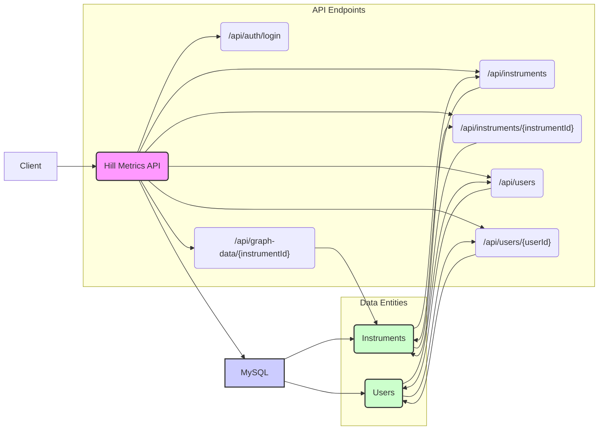

###   Hill Metrics API Documentation

####   1. Instruments

* **Get Instruments**

    * `GET /api/instruments`
    * Description: Retrieves a list of instruments based on various filters and search criteria.
    * Parameters:
        * `search` (string, optional): Full-text search query.
        * `isinCode` (string, optional): Search by ISIN code.
        * `instrumentTypeId` (integer, optional): Filter by instrument type.
        * `assetCategoryId` (integer, optional): Filter by asset category.
        * `sectorId` (integer, optional): Filter by sector.
        * `marketId` (integer, optional): Filter by market.
        * `marketTypeId` (integer, optional): Filter by market type.
        * `performance` (string, optional): Filter by performance (e.g., `greaterThan`, `lessThan`, `equalTo`).
        * `performanceValue` (decimal, optional): Value for performance filter.
        * `performanceTimeframe` (string, optional): Timeframe for performance filter (e.g., `1 year`, `3 years`).
        * `risk` (integer, optional): Filter by risk level.
        * `liquidity` (string, optional): Filter by liquidity level.
        * `marketCapMin` (decimal, optional): Minimum market capitalization.
        * `marketCapMax` (decimal, optional): Maximum market capitalization.
        * `currency` (string, optional): Filter by currency.
        * `valuationFrequency` (string, optional): Filter by valuation frequency.
        * `sortBy` (string, optional): Field to sort by.
        * `sortOrder` (string, optional): Sort order (`asc` or `desc`).
        * `page` (integer, optional): Page number for pagination.
        * `pageSize` (integer, optional): Number of items per page.
    * Response:
        * Status Code: 200 OK
        * Body:

            ```json
            [
              {
                "instrumentId": 1,
                "name": "Apple Inc.",
                "isinCode": "US0378331005",
                "instrumentTypeId": 1,
                "category": "Stock",
                "price": 170.00,
                "currency": "USD",
                "rating": 4,
                "risk": 5,
                "ytdPerformance": 0.20,
                "oneYearPerformance": 0.35,
                "threeYearPerformance": 0.28,
                "lastUpdated": "2024-03-13T10:00:00Z"
                // ... other instrument details
              },
              // ... more instruments
            ]
            ```
* **Get Instrument Details**

    * `GET /api/instruments/{instrumentId}`
    * Description: Retrieves detailed information for a specific instrument.
    * Parameters:
        * `instrumentId` (integer, required): The ID of the instrument.
    * Response:
        * Status Code: 200 OK
        * Body:

            ```json
            {
                "instrumentId": 1,
                "name": "Apple Inc.",
                "isinCode": "US0378331005",
                "instrumentTypeId": 1,
                "category": "Stock",
                "price": 170.00,
                "currency": "USD",
                "rating": 4,
                "risk": 5,
                "ytdPerformance": 0.20,
                "oneYearPerformance": 0.35,
                "threeYearPerformance": 0.28,
                "lastUpdated": "2024-03-13T10:00:00Z",
                 "specificDetails": { // Depending on instrument type
                    "fees": 0.01,
                    "safenessIndicator": "High",
                    "circulatingSupply": 10000000000
                 },
                "performanceMetrics": {
                    "performanceLastDay": 0.02,
                    "performanceYTD": 0.20,
                     "performance3Years": 0.30,
                    "volatilityYTD": 0.10,
                    "volatility3Years": 0.15,
                    "volatility5Years": 0.20,
                    "sharpeRatio": 1.2,
                    "riskNotation": 5
                },
                "qualityMetrics": {
                    "liquidity": 80,
                    "marketcap": 90,
                    "performance": 75,
                    "reliability": 85
                },
                "feeStructure": {
                     "subscriptionFee": 0.025,
                     "redemptionFee": 0,
                     "managementFee": 0.02,
                     "performanceFee": 0,
                     "ongoingCharges": 0.0226,
                     "priipsManagementFee": 0.0198,
                     "transactionFee": 0.001
                 }
                // ... other details
            }
            ```
* **Get Similar Instruments**

    * `GET /api/instruments/{instrumentId}/similar`
    * Description: Retrieves a list of instruments similar to a specific instrument.
    * Parameters:
        * `instrumentId` (integer, required): The ID of the instrument.
    * Response:
        * Status Code: 200 OK
        * Body:

            ```json
            [
              {
                "instrumentId": 2,
                "name": "Ethereum",
                "logo": "ethereum.png",
                "marketCap": 200000000000,
                "categoryTag": "Cryptocurrency",
                "comparisonDescriptor": "Similar with higher performance"
              },
              // ... more similar instruments
            ]
            ```

####   2. Instrument Types

* **Get Instrument Types**

    * `GET /api/instrument-types`
    * Description: Retrieves a list of instrument types.
    * Response:
        * Status Code: 200 OK
        * Body:

            ```json
            [
              {
                "instrumentTypeId": 1,
                "name": "Stock",
                "parentTypeId": null
              },
              {
                "instrumentTypeId": 2,
                "name": "Bond",
                "parentTypeId": null
              },
              // ... more instrument types
            ]
            ```

####   3. Asset Categories

* **Get Asset Categories**

    * `GET /api/asset-categories`
    * Description: Retrieves a list of asset categories.
    * Response:
        * Status Code: 200 OK
        * Body:

            ```json
            [
              {
                "assetCategoryId": 1,
                "name": "Crypto"
              },
              {
                "assetCategoryId": 2,
                "name": "Mutual Funds"
              },
              // ... more asset categories
            ]
            ```

####   4. Sectors

* **Get Sectors**

    * `GET /api/sectors`
    * Description: Retrieves a list of sectors.
    * Response:
        * Status Code: 200 OK
        * Body:

            ```json
            [
              {
                "sectorId": 1,
                "name": "Technology",
                "parentSectorId": null
              },
              {
                "sectorId": 2,
                "name": "Software",
                "parentSectorId": 1
              },
              // ... more sectors
            ]
            ```

####   5. Markets

* **Get Markets**

    * `GET /api/markets`
    * Description: Retrieves a list of markets.
    * Response:
        * Status Code: 200 OK
        * Body:

            ```json
            [
              {
                "marketId": 1,
                "name": "USA",
                "marketTypeId": 1
              },
              {
                "marketId": 2,
                "name": "Japan",
                "marketTypeId": 1
              },
              // ... more markets
            ]
            ```

####   6. Market Types

* **Get Market Types**

    * `GET /api/market-types`
    * Description: Retrieves a list of market types.
    * Response:
        * Status Code: 200 OK
        * Body:

            ```json
            [
              {
                "marketTypeId": 1,
                "name": "Developed"
              },
              {
                "marketTypeId": 2,
                "name": "Emerging"
              },
              // ... more market types
            ]
            ```

####   7. Graph Data

* **Get Graph Data**

    * `GET /api/graph-data/{instrumentId}`
    * Description: Retrieves graph data for a specific instrument.
    * Parameters:
        * `instrumentId` (integer, required): The ID of the instrument.
        * `metric` (string, required): The metric for which to retrieve data (e.g., `price`, `volume`, `marketcap`).
        * `from` (datetime, optional): Start date and time for the data range.
        * `to` (datetime, optional): End date and time for the data range.
    * Response:
        * Status Code: 200 OK
        * Body:

            ```json
            [
              {
                "timestamp": "2024-03-12T00:00:00Z",
                "value": 165.00
              },
              {
                "timestamp": "2024-03-13T00:00:00Z",
                "value": 170.00
              },
              // ... more data points
            ]
            ```

####   8. Users

* **Create User**

    * `POST /api/users`
    * Description: Creates a new user.
    * Request Body:

        ```json
        {
          "username": "newuser",
          "email": "newuser@example.com",
          "password": "securepassword"
        }
        ```
    * Response:
        * Status Code: 201 Created
        * Body:

            ```json
            {
              "userId": 1,
              "username": "newuser",
              "email": "newuser@example.com"
            }
            ```
* **Get User**

    * `GET /api/users/{userId}`
    * Description: Retrieves a user by ID.
    * Parameters:
        * `userId` (integer, required): The ID of the user.
    * Response:
        * Status Code: 200 OK
        * Body:

            ```json
            {
              "userId": 1,
              "username": "newuser",
              "email": "newuser@example.com"
            }
            ```
* **Update User**

    * `PUT /api/users/{userId}`
    * Description: Updates a user's information.
    * Parameters:
        * `userId` (integer, required): The ID of the user.
    * Request Body:

        ```json
        {
          "username": "updateduser",
          "email": "updateduser@example.com"
          // ... other fields to update
        }
        ```
    * Response:
        * Status Code: 200 OK
        * Body:

            ```json
            {
              "userId": 1,
              "username": "updateduser",
              "email": "updateduser@example.com"
            }
            ```
* **Delete User**

    * `DELETE /api/users/{userId}`
    * Description: Deletes a user.
    * Parameters:
        * `userId` (integer, required): The ID of the user.
    * Response:
        * Status Code: 204 No Content

####   9. Authentication

* **Login**

    * `POST /api/auth/login`
    * Description: Authenticates a user and returns a token.
    * Request Body:

        ```json
        {
          "username": "user",
          "password": "password"
        }
        ```
    * Response:
        * Status Code: 200 OK
        * Body:

            ```json
            {
              "token": "your_auth_token"
            }
            ```

####   10. Updates

* The data should be updated daily, so a background job should be implemented to update the data in the database.

###   Important Considerations

* **Security:**
    * Implement robust authentication and authorization mechanisms (e.g., JWT, OAuth 2.0).
    * Hash and salt passwords securely.
* **Validation:**
    * Validate all incoming data to ensure data integrity.
    * Return appropriate error messages for invalid requests.
* **Error Handling:**
    * Implement consistent error handling throughout the API.
    * Return meaningful error messages to the client.
* **Pagination:**
    * Use pagination for all endpoints that return large lists of data.
* **Versioning:**
    * Consider API versioning to allow for future updates without breaking existing clients (e.g., `/api/v1/instruments`).
* **Documentation Tools:**
    * Use tools like Swagger (OpenAPI) to generate interactive API documentation.

This expanded API documentation includes user management and authentication, providing a more complete picture of the Hill Metrics application's API. Remember to tailor it further based on your specific security, validation, and error-handling requirements.


**API Diagram:**


