###   1. Core Tables

* **Instruments**

    * `instrument_id` (INT, Primary Key, Auto-increment)
    * `name` (VARCHAR(255))
    * `isin_code` (VARCHAR(12), Unique)
    * `instrument_type_id` (INT, Foreign Key to `InstrumentTypes`)
    * `category` (VARCHAR(255))
    * `price` (DECIMAL(18, 4))
    * `currency` (VARCHAR(10))
    * `rating` (INT)
    * `risk` (INT)
    * `ytd_performance` (DECIMAL(10, 2))
    * `one_year_performance` (DECIMAL(10, 2))
    * `three_year_performance` (DECIMAL(10, 2))
    * `last_updated` (DATETIME)
    * `original_market` (VARCHAR(255))
    * `asset_manager_issuer` (VARCHAR(255))
    * `dividend_value` (DECIMAL(18, 4))
    * `dividend_frequency` (VARCHAR(50))
    * `fees` (DECIMAL(10, 2))
    * `distribution_policy` (VARCHAR(255))
    * `legal_status` (VARCHAR(255))
    * `investor_type` (VARCHAR(255))
* **InstrumentTypes**

    * `instrument_type_id` (INT, Primary Key, Auto-increment)
    * `name` (VARCHAR(255)) (e.g., Stock, Bond, Crypto)
    * `parent_type_id` (INT, Foreign Key to `InstrumentTypes` for hierarchical structure, can be NULL)
* **AssetCategories**

    * `asset_category_id` (INT, Primary Key, Auto-increment)
    * `name` (VARCHAR(255)) (e.g., Crypto, Mutual Funds, Stocks)
* **Sectors**

    * `sector_id` (INT, Primary Key, Auto-increment)
    * `name` (VARCHAR(255)) (e.g., Information Technology, Energy)
    * `parent_sector_id` (INT, Foreign Key to `Sectors` for hierarchical structure, can be NULL)
* **Markets**

    * `market_id` (INT, Primary Key, Auto-increment)
    * `name` (VARCHAR(255)) (e.g., USA, Japan, India)
    * `market_type_id` (INT, Foreign Key to `MarketTypes`)
* **MarketTypes**

    * `market_type_id` (INT, Primary Key, Auto-increment)
    * `name` (VARCHAR(255)) (e.g., Developed, Emerging, Frontier)

###   2. Specific Data Tables

* **CryptoDetails**

    * `instrument_id` (INT, Primary Key, Foreign Key to `Instruments`)
    * `fees` (DECIMAL(10, 2))
    * `safeness_indicator` (VARCHAR(255))
    * `circulating_supply` (BIGINT)
    * `layer` (VARCHAR(255))
    * `consensus_mechanism` (VARCHAR(255))
    * `validator` (VARCHAR(255))
    * `active_developers` (INT)
    * `stacking_percentage` (DECIMAL(10, 2))
    * `availability` (VARCHAR(255))
    * `scalability` (VARCHAR(255))
* **MutualFundDetails**

    * `instrument_id` (INT, Primary Key, Foreign Key to `Instruments`)
    * `asset_manager_issuer` (VARCHAR(255))
    * `dividend_value` (DECIMAL(18, 4))
    * `dividend_frequency` (VARCHAR(50))
    * `fees` (DECIMAL(10, 2))
    * `distribution_policy` (VARCHAR(255))
    * `legal_status` (VARCHAR(255))
    * `investor_type` (VARCHAR(255))
* **BondDetails**

    * `instrument_id` (INT, Primary Key, Foreign Key to `Instruments`)
    * `asset_manager_issuer` (VARCHAR(255))
    * `dividend_value` (DECIMAL(18, 4))
    * `dividend_frequency` (VARCHAR(50))
    * `maturity` (DATE)
* **RealEstateDetails**

    * `instrument_id` (INT, Primary Key, Foreign Key to `Instruments`)
    * `asset_manager_issuer` (VARCHAR(255))
    * `dividend_value` (DECIMAL(18, 4))
* **CommoditiesDetails**

    * `instrument_id` (INT, Primary Key, Foreign Key to `Instruments`)
    * `original_market` (VARCHAR(255))
* **PrivateEquityDetails**

    * `instrument_id` (INT, Primary Key, Foreign Key to `Instruments`)
    * `asset_manager_issuer` (VARCHAR(255))
    * `dividend_value` (DECIMAL(18, 4))
    * `fees` (DECIMAL(10, 2))

###   3. Performance and Metrics

* **PerformanceMetrics**

    * `instrument_id` (INT, Primary Key, Foreign Key to `Instruments`)
    * `performance_last_day` (DECIMAL(10, 2))
    * `performance_ytd` (DECIMAL(10, 2))
    * `performance_3_years` (DECIMAL(10, 2))
    * `volatility_ytd` (DECIMAL(10, 2))
    * `volatility_3_years` (DECIMAL(10, 2))
    * `volatility_5_years` (DECIMAL(10, 2))
    * `sharpe_ratio` (DECIMAL(10, 2))
    * `risk_notation` (INT)
* **QualityMetrics**

    * `instrument_id` (INT, Primary Key, Foreign Key to `Instruments`)
    * `liquidity` (INT)
    * `marketcap` (INT)
    * `performance` (INT)
    * `reliability` (INT)

###   4. Additional Attributes

* **InstrumentAddlAttributes**

    * `instrument_id` (INT, Primary Key, Foreign Key to `Instruments`)
    * `currency` (VARCHAR(10))
    * `valuation_frequency` (VARCHAR(50))
    * `volume` (BIGINT)
    * `high` (DECIMAL(18, 4))
    * `low` (DECIMAL(18, 4))
    * `benchmark_category` (VARCHAR(255))
    * `inception_date` (DATE)

###   5. Graph Data

* **GraphData**

    * `graph_data_id` (INT, Primary Key, Auto-increment)
    * `instrument_id` (INT, Foreign Key to `Instruments`)
    * `metric` (VARCHAR(50)) (e.g., Price, Volume, Marketcap)
    * `timestamp` (DATETIME)
    * `value` (DECIMAL(18, 4))

###   6. Fees

* **FeeStructure**

    * `instrument_id` (INT, Primary Key, Foreign Key to `Instruments`)
    * `subscription_fee` (DECIMAL(5, 2))
    * `redemption_fee` (DECIMAL(5, 2))
    * `management_fee` (DECIMAL(5, 2))
    * `performance_fee` (DECIMAL(5, 2))
    * `ongoing_charges` (DECIMAL(5, 2))
    * `priips_management_fee` (DECIMAL(5, 2))
    * `transaction_fee` (DECIMAL(5, 2))

###   7. Ranking

* **PerformanceRanking**

    * `instrument_id` (INT, Primary Key, Foreign Key to `Instruments`)
    * `one_month_ranking` (INT)
    * `three_month_ranking` (INT)
    * `one_year_ranking` (INT)
    * `three_year_ranking` (INT)
    * `five_year_ranking` (INT)
    * `ten_year_ranking` (INT)

###   8. Relations

* **Instrument\_AssetCategories** (Many-to-Many Relationship)

    * `instrument_id` (INT, Foreign Key to `Instruments`)
    * `asset_category_id` (INT, Foreign Key to `AssetCategories`)
* **Instrument\_Sectors** (Many-to-Many Relationship)

    * `instrument_id` (INT, Foreign Key to `Instruments`)
    * `sector_id` (INT, Foreign Key to `Sectors`)

###   9. Users

* **Users**

    * `user_id` (INT, Primary Key, Auto-increment)
    * `username` (VARCHAR(255), Unique)
    * `email` (VARCHAR(255), Unique)
    * `password_hash` (VARCHAR(255))
    * `created_at` (TIMESTAMP, Default CURRENT_TIMESTAMP)
    * `updated_at` (TIMESTAMP, Default CURRENT_TIMESTAMP ON UPDATE CURRENT_TIMESTAMP)

###   Explanation of Key Improvements

* **Password Security:**
    * `password_hash` in the `Users` table stores the hashed password, not the plain text. Use a strong hashing algorithm like bcrypt.
* **Timestamps:**
    * `created_at` and `updated_at` in the `Users` table help track when users were created and last modified.
* **Uniqueness:**
    * `username` and `email` in the `Users` table are set to `UNIQUE` to ensure data integrity.

###   Important Considerations

* **Indexing:**
    * Add indexes to foreign key columns (e.g., `instrument_type_id`, `sector_id`, `instrument_id`) to speed up joins.
    * Index columns used for filtering and sorting (e.g., `isin_code`, `name`, `price`).
* **Data Types:**
    * Choose data types carefully based on the expected range and precision of the data. For example, use `BIGINT` for large integer values.
* **Normalization:**
    * This schema is generally normalized. However, consider denormalization for specific reporting or performance needs.
* **Relationships:**
    * The relationships between tables are defined using foreign keys. Ensure these are enforced in your database.

**DB Scheme Diagram:**

```mermaid
erDiagram
    Instruments {
        int instrument_id PK
        varchar name
        varchar isin_code
        int instrument_type_id FK
        varchar category
        decimal price
        varchar currency
        int rating
        int risk
        decimal ytd_performance
        decimal one_year_performance
        decimal three_year_performance
        datetime last_updated
        varchar original_market
        varchar asset_manager_issuer
        decimal dividend_value
        varchar dividend_frequency
        decimal fees
        varchar distribution_policy
        varchar legal_status
        varchar investor_type
    }
    InstrumentTypes {
        int instrument_type_id PK
        varchar name
        int parent_type_id FK
    }
    AssetCategories {
        int asset_category_id PK
        varchar name
    }
    Sectors {
        int sector_id PK
        varchar name
        int parent_sector_id FK
    }
    Markets {
        int market_id PK
        varchar name
        int market_type_id FK
    }
    MarketTypes {
        int market_type_id PK
        varchar name
    }
    CryptoDetails {
        int instrument_id PK, FK
        decimal fees
        varchar safeness_indicator
        bigint circulating_supply
        varchar layer
        varchar consensus_mechanism
        varchar validator
        int active_developers
        decimal stacking_percentage
        varchar availability
        varchar scalability
    }
    MutualFundDetails {
        int instrument_id PK, FK
        varchar asset_manager_issuer
        decimal dividend_value
        varchar dividend_frequency
        decimal fees
        varchar distribution_policy
        varchar legal_status
        varchar investor_type
    }
    BondDetails {
        int instrument_id PK, FK
        varchar asset_manager_issuer
        decimal dividend_value
        varchar dividend_frequency
        date maturity
    }
    RealEstateDetails {
        int instrument_id PK, FK
        varchar asset_manager_issuer
        decimal dividend_value
    }
    CommoditiesDetails {
        int instrument_id PK, FK
        varchar original_market
    }
    PrivateEquityDetails {
        int instrument_id PK, FK
        varchar asset_manager_issuer
        decimal dividend_value
        decimal fees
    }
    PerformanceMetrics {
        int instrument_id PK, FK
        decimal performance_last_day
        decimal performance_ytd
        decimal performance_3_years
        decimal volatility_ytd
        decimal volatility_3_years
        decimal volatility_5_years
        decimal sharpe_ratio
        int risk_notation
    }
    QualityMetrics {
        int instrument_id PK, FK
        int liquidity
        int marketcap
        int performance
        int reliability
    }
    InstrumentAddlAttributes {
        int instrument_id PK, FK
        varchar currency
        varchar valuation_frequency
        bigint volume
        decimal high
        decimal low
        varchar benchmark_category
        date inception_date
    }
    GraphData {
        int graph_data_id PK
        int instrument_id FK
        varchar metric
        datetime timestamp
        decimal value
    }
    FeeStructure {
        int instrument_id PK, FK
        decimal subscription_fee
        decimal redemption_fee
        decimal management_fee
        decimal performance_fee
        decimal ongoing_charges
        decimal priips_management_fee
        decimal transaction_fee
    }
    PerformanceRanking {
        int instrument_id PK, FK
        int one_month_ranking
        int three_month_ranking
        int one_year_ranking
        int three_year_ranking
        int five_year_ranking
        int ten_year_ranking
    }
    Users {
        int user_id PK
        varchar username
        varchar email
        varchar password_hash
        timestamp created_at
        timestamp updated_at
    }
    Instrument_AssetCategories {
        int instrument_id FK
        int asset_category_id FK
    }
    Instrument_Sectors {
        int instrument_id FK
        int sector_id FK
    }

    Instruments ||--o{ InstrumentTypes : "belongs to"
    Instruments ||--o{ AssetCategories : "belongs to"
    Instruments ||--o{ Sectors : "belongs to"
    Instruments ||--o{ Markets : "belongs to"
    Markets ||--o{ MarketTypes : "belongs to"
    CryptoDetails ||--|| Instruments : "one-to-one"
    MutualFundDetails ||--|| Instruments : "one-to-one"
    BondDetails ||--|| Instruments : "one-to-one"
    RealEstateDetails ||--|| Instruments : "one-to-one"
    CommoditiesDetails ||--|| Instruments : "one-to-one"
    PrivateEquityDetails ||--|| Instruments : "one-to-one"
    PerformanceMetrics ||--|| Instruments : "one-to-one"
    QualityMetrics ||--|| Instruments : "one-to-one"
    InstrumentAddlAttributes ||--|| Instruments : "one-to-one"
    GraphData ||--o{ Instruments : "belongs to"
    FeeStructure ||--|| Instruments : "one-to-one"
    PerformanceRanking ||--|| Instruments : "one-to-one"
    Instrument_AssetCategories ||--o{ Instruments : "belongs to"
    Instrument_AssetCategories ||--o{ AssetCategories : "belongs to"
    Instrument_Sectors ||--o{ Instruments : "belongs to"
    Instrument_Sectors ||--o{ Sectors : "belongs to"
```

