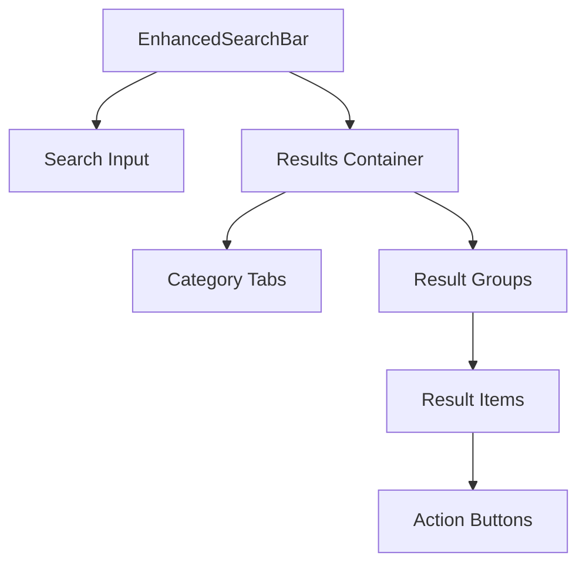

# Enhanced Search Bar Component Specification

## Overview

This document provides the technical specification for the Enhanced Search Bar component, a global search interface that displays real-time suggestions in a dropdown container with multiple filter tabs. The component implements a rich set of features including debounced search input, category filtering, and item action buttons.

## Component Architecture



## Data Models

```typescript
// Category type for filter tabs
interface Category {
  id: string;
  label: string;
  count: number;
}

// Group of search results
interface ResultGroup {
  id: string;
  label: string;
  count: number;
  items: ResultItem[];
}

// Individual search result
interface ResultItem {
  id: string;
  name: string;
  ticker: string;
  category: string;
  addedToComparison: boolean;
  addedToList: boolean;
}

// Search results structure
interface SearchResults {
  categories: Category[];
  groups: ResultGroup[];
  loading: boolean;
  empty: boolean;
}
```

## Component Breakdown

### 1. EnhancedSearchBar

Primary component that coordinates the search functionality.

**Features:**
- Debounced input handling (120ms)
- Input field with clear button
- Integration with search service
- State management for search results
- Outside click detection to hide results

### 2. CategoryTabs

Horizontal tabs for filtering search results by category.

**Features:**
- Tab selection state
- Count badge for each category
- Active/inactive/hover states
- Scrollable overflow for many categories

### 3. ResultsContainer

Container for displaying search results with appropriate states.

**Features:**
- Loading indicator
- Empty state message
- Category tabs
- Scrollable results list with max height
- Layout for result groups and items

### 4. ResultGroup

Groups search results by category or label.

**Features:**
- Group header with count
- Horizontal divider
- Container for result items

### 5. ResultItem

Individual search result with action buttons.

**Features:**
- Display for name and ticker
- "Add to Comparison" button
- "Add to List" button
- "View" button
- State tracking for added items

## Interactions

### Search Input
- User types in search box
- Input is debounced for 120ms
- Search is triggered after debounce
- Clear button appears when text is present
- Results container appears with loading state

### Category Filtering
- User clicks a category tab
- Results are filtered to show only items in that category
- Active tab is highlighted
- Empty state shows if no results match the filter

### Item Actions
- User clicks "Add to Comparison"
  - Button state changes to "Added to Comparison"
  - State is persisted during the session
- User clicks "Add to List"
  - Button state changes to "Added to List"
  - State is persisted during the session
- User clicks "View"
  - Would navigate to item details (currently logs to console)

## States

### Search Results Container
1. **Loading State**: Shows spinner while waiting for results
2. **Empty State**: Shows message when no results found
3. **Results State**: Shows tabs and result groups
4. **Filtered Empty State**: Shows message when filter has no matching items

### Search Input
1. **Default State**: Normal border
2. **Hover State**: Light border highlight
3. **Focus State**: Strong border and ring
4. **With Text**: Shows clear button

### Buttons
1. **Default State**: Gray background
2. **Hover State**: Darker gray background
3. **Added to Comparison**: Purple background
4. **Added to List**: Green background

## Technical Implementation

### Debounce Function
Custom hook that delays executing a function until after a specified timeout:

```typescript
function useDebounce<T>(value: T, delay: number): T {
  const [debouncedValue, setDebouncedValue] = useState<T>(value);

  useEffect(() => {
    const handler = setTimeout(() => {
      setDebouncedValue(value);
    }, delay);

    return () => {
      clearTimeout(handler);
    };
  }, [value, delay]);

  return debouncedValue;
}
```

### Outside Click Detection
Uses React ref and useEffect to detect clicks outside the component:

```typescript
const searchContainerRef = useRef<HTMLDivElement>(null);

useEffect(() => {
  const handleClickOutside = (event: MouseEvent) => {
    if (
      searchContainerRef.current &&
      !searchContainerRef.current.contains(event.target as Node)
    ) {
      setShowResults(false);
    }
  };

  document.addEventListener('mousedown', handleClickOutside);
  return () => {
    document.removeEventListener('mousedown', handleClickOutside);
  };
}, []);
```

### Mock Data Service
For UI development, we use a mock service that:
1. Simulates network delays
2. Filters results based on search term
3. Tracks added item states
4. Provides category filtering

In a real implementation, this would be replaced with actual API calls to a backend service.

## API

### EnhancedSearchBar Props
```typescript
interface EnhancedSearchBarProps {
  onSearch?: (query: string) => void;
  className?: string;
  placeholder?: string;
}
```

### CategoryTabs Props
```typescript
interface CategoryTabsProps {
  categories: Category[];
  selectedCategory: string;
  onSelectCategory: (categoryId: string) => void;
}
```

### ResultsContainer Props
```typescript
interface ResultsContainerProps {
  results: SearchResults;
  selectedCategory: string;
  onSelectCategory: (categoryId: string) => void;
  onAddToComparison: (itemId: string, added: boolean) => void;
  onAddToList: (itemId: string, added: boolean) => void;
  onView: (itemId: string) => void;
}
```

### ResultGroup Props
```typescript
interface ResultGroupProps {
  group: ResultGroupType;
  onAddToComparison: (itemId: string, added: boolean) => void;
  onAddToList: (itemId: string, added: boolean) => void;
  onView: (itemId: string) => void;
}
```

### ResultItem Props
```typescript
interface ResultItemProps {
  item: ResultItemType;
  onAddToComparison: (itemId: string, added: boolean) => void;
  onAddToList: (itemId: string, added: boolean) => void;
  onView: (itemId: string) => void;
}
```

## Accessibility Considerations
- Keyboard navigation
- ARIA attributes
- Proper contrast
- Focus indicators

## Performance Considerations
- Debouncing search input to reduce API calls
- Virtualized scrolling for large results lists (future enhancement)
- Memoization for expensive renders (future enhancement)

## Future Enhancements
- Keyboard navigation for results
- Virtualized list for performance with large results sets
- Recent searches history
- Voice search capability
- Advanced search syntax
- Server-side integration
