Maci realtime

**Hill Metrics Application Documentation**

**1. Introduction**

Hill Metrics is a financial screener tool designed to help investors, analysts, and traders efficiently filter and analyze financial securities based on specific criteria. It streamlines the process of identifying potential investment opportunities by allowing users to set parameters such as market capitalization, price-to-earnings (P/E) ratio, dividend yield, revenue growth, and technical indicators.

**2. Technology Stack**

* **Backend:** .NET (ASP.NET Core Web API)
* **Database:** MySQL
* **Frontend:** React (with Redux/Zustand for state management, React Router for routing)

**3. Key Functionalities**

* **Full-Text Search:**
    * Supports advanced full-text search capabilities, including stemming, synonyms, and language-specific text analysis for highly relevant results.
    * Implements full-text search across all data or specific fields (to be specified).
    * Implementation: Using MySQL's full-text search capabilities or a dedicated search library like Lucene.NET.
    * Scalability: Handles large volumes of data effortlessly with distributed architecture, ensuring fast query responses and high availability.
    * Faceted Navigation: Allows dynamic filtering and categorization of search results for enhanced user experience (per asset type).
    * High Performance: Leverages efficient data structures and indexing techniques to provide low-latency search results.
* **Filtering:**
    * Filters can be combined to refine search results.
    * **Filter by Asset Type:**
        * Allows users to select the type of financial asset they are looking for, based on their investment objectives, strategy, and risk tolerance.
        * A hierarchical structure enables more detailed exploration of each main category through subcategories for more precise searches.
        * Users can search by keyword to quickly find a specific sector or sub-sector.
        * Users can select multiple types and subtypes simultaneously to compare different opportunities.
        * Search results update in real-time based on user selections when clicking on “Apply”.
        * The selected filters are visually indicated to the user (e.g., displayed as tags or chips).
    * **Filter by Activity Sectors:**
        * Helps investors target the economic sectors they want to invest in.
        * A hierarchical structure with main sectors (e.g., technology, healthcare, finance) and specific sub-sectors (e.g., for technology: software, semiconductors, IT services).
        * Users can search by keyword to quickly find a specific sector or sub-sector.
        * Users can select multiple sectors and sub-sectors simultaneously.
        * Search results update in real-time based on user selections when clicking on “Apply”.
        * The selected filters are visually indicated to the user (e.g., displayed as tags or chips).
    * **Filter by Market Type:**
        * Allows investors to choose the region or level of economic development they want to invest in.
        * Users can select the market type: Developed Markets, Emerging Markets, Frontier Markets.
        * A country list adapts dynamically based on the selected market type.
        * Allow multi-selection of countries.
        * The selected filters are visually indicated to the user (e.g., displayed as tags or chips).
    * **Filter on Characteristics Applicable to All Assets:**
        * Provides general sorting options that apply to all asset types.
        * Possible criteria: Performance, Risk indicator, Liquidity indicator, Marketcap indicator.
        * The selected filters are visually indicated to the user (e.g., displayed as tags or chips).

**4. Search Bar by Name or ISIN Code**

* **Functionality:**
    * Users can search for financial instruments using either their name or ISIN code.
    * **Search by Name:**
        * Users can enter all or part of a financial instrument's name.
        * An auto-completion search provides suggestions based on input.
        * The search is case-insensitive.
        * Results are sorted by relevance.
    * **Search by ISIN Code:**
        * Users can enter a complete ISIN code.
        * If the code is valid and recognized, the corresponding instrument is displayed directly.
        * An error message appears if the ISIN is invalid or not found.
    * **Multi-search:**
        * Users can search multiple instruments.
        * They can insert ISIN codes by copy/pasting from Excel.
        * The search bar accepts multiple ISIN codes separated by commas, spaces, or new lines.
* **Interface Behavior:**
    * The search bar is accessible at the top of the screen.
    * A dropdown list displays up to 10 results.
    * Each result includes:
        * The instrument name
        * Its ISIN code
        * Its type (stock, bond, etc.)
    * If no results are found, a message "No results found" is displayed.
* **Validation and Error Handling:**
    * ISIN code length validation (12 alphanumeric characters).
    * ISIN format verification: starts with 2 letters followed by 10 digits/letters.
    * Input error handling:
        * If fewer than 3 characters are entered for a name search, an indication is displayed.
        * In case of a server error, an alert message is shown.
* **Performance and Limitations:**
    * Name search is instantaneous thanks to advanced indexing.
    * ISIN search is optimized for fast data access.
    * The database is updated daily.
* **Use Cases:**
    * A user types "Apple" and sees instruments related to Apple Inc.
    * A user enters "FR0000123456" and directly accesses the corresponding instrument.

**5. Filter Dropdown Panels**

* For each filter panel, selected filters are visually indicated to the user (e.g., displayed as tags or chips).
* **Asset Selection Dropdown Panel:**
    * Filters financial instruments based on asset categories.
    * **Displayed Information:**
        * Search Bar: Users can type in keywords to quickly find asset categories.
        * Select All / Clear: Options to bulk-select or clear all selected assets.
        * Asset Categories: Crypto, Mutual Funds, Stocks, Bonds, Real Estate, Commodities, Private Equity.
        * Cancel/Apply Buttons.
    * **Interface Behavior:**
        * Collapsible Categories: Each asset class has an expandable section for more granular selection.
        * Multi-Select Functionality.
        * Dynamic Filtering: Selecting asset types updates the displayed results in real time.
    * **Use Cases:**
        * Refined Asset Selection, Comparative Analysis, Portfolio Diversification, Customized Views.
* **Sector Filter Dropdown Panel:**
    * Refines financial instrument search by selecting specific industry sectors.
    * **Displayed Information:**
        * Search Bar, Select All / Clear.
        * Sector Categories: Information Technology, Energy, Materials, Industrials, Consumer Discretionary, Consumer Staples, Health Care.
        * Cancel/Apply Buttons.
    * **Interface Behavior:**
        * Collapsible Industry Categories.
        * Multi-Select Functionality.
        * Real-Time Filtering.
    * **Use Cases:**
        * Industry-Specific Investing, Sector-Based Portfolio Allocation, Comparative Sector Analysis, Targeted Investment Strategies.
* **Market Selection Dropdown Panel:**
    * Filters financial instruments based on their geographical market classification and development stage.
    * **Displayed Information:**
        * Search Bar, Select All / Clear.
        * Development Stage Filters: Developed Markets, Emerging Markets, Frontier Markets.
        * Geographic Location Filters: Europe, North America, Asia, Oceania.
        * Cancel/Apply Buttons.
    * **Interface Behavior:**
        * Collapsible Regions.
        * Multi-Select Functionality.
        * Real-Time Updates.
    * **Use Cases:**
        * Regional Investment Focus, Market Development Strategy, Comparative Market Analysis, Portfolio Diversification.
* **Common Filters Dropdown Panel:**
    * Filters financial instrument search based on key attributes such as return, reliability, liquidity, and market capitalization.
    * **Displayed Information:**
        * Return Filter: Condition Selection ("Greater than," "Less than," or "Equal to."), Percentage Input, Timeframe Selection.
        * Reliability Filter: Slider with levels (Very Low to Very High).
        * Liquidity Filter: Slider with levels (Very Low to Very High).
        * Market Capitalization Filter: Minimum and maximum range input.
        * Cancel/Apply Buttons.
    * **Interface Behavior:**
        * Dynamic Filtering, Multi-Condition Input, Color-Coded Sliders, Real-Time Adjustments.
    * **Use Cases:**
        * High-Return Investments, Risk-Based Selection, Market Cap Segmentation, Custom Investment Strategies.
* **Advanced Filters Panel:**
    * Refines search criteria when analyzing financial instruments.
    * **Displayed Filter Categories:**
        * CURRENCY, VALUATION FREQUENCY, VOLUME, HIGH / LOW, BENCHMARK CATEGORY, INCEPTION DATE.
    * Search Bar, Dropdown Expansion.
    * **Interface Behavior:**
        * Dynamic Filtering, Real-Time Updates, Collapsible Sections, Search Assistance.
    * **Use Cases:**
        * Performance-Based Selection, Asset Type Segmentation, Efficient Navigation, Customizable Comparisons.
* **Specific Filters Panel:**
    * Refines financial instrument search based on asset categories and customized filters.
    * **Displayed Information:**
        * Asset Categories: Cryptocurrency, Mutual Funds, Stocks, Bonds, Real Estate, Private Equity, Commodities.
        * Filter Options:
            * Mutual Funds: ASSET MANAGER / ISSUER, DIVIDEND, FEES, DISTRIBUTION POLICY, LEGAL STATUS, INVESTOR TYPE.
            * Stocks: DIVIDEND, ORIGINAL MARKET.
            * Bonds: ASSET MANAGER / ISSUER, DIVIDEND, MATURITY.
            * Real Estate: ASSET MANAGER / ISSUER, DIVIDEND.
            * Crypto: FEES, SAFENESS INDICATOR, CIRCULATING SUPPLY, LAYER, CONSENSUS, VALIDATOR / MINING NUMBER, ACTIVE DEVELOPPER (NUMBER), STACKING (%), AVAILABILITY, SCALABITLITY.
            * Commodities: ORIGINAL MARKET.
            * Private Equity: ASSET MANAGER / ISSUER, DIVIDEND, FEES.
    * **Interface Behavior:**
        * Multi-Category Selection, Dropdown Selection, Dynamic Updates, Expandable Filter Boxes.
    * **Use Cases:**
        * Customized Investment Screening, Multi-Asset Comparison, Fee Optimization, Safety and Risk Management.

**6. Results Board**

* **Description:**
    * The core of the interface, displaying the financial assets or instruments that match the applied search or filter criteria.
* **Key Functionalities:**
    * Selection box: Allow the user to select the instrument.
    * **Column Display:**
        * Name: Displays the full name of the asset.
        * Category: Specifies the type of asset.
        * Price: The latest price.
        * Currency: Indicates the currency.
        * Rating: Displays a quality or reliability score (1 to 5 stars).
        * Risk: Shows the risk level of the asset (1 to 7).
        * YTD %: (Year-to-Date Performance).
        * 1-Year %: (1-Year Performance).
        * 3-Year %: (3-Year Performance).
        * Date: Displays the last update date.
    * Inside results board search tool: Dynamic search tool focusing on instruments inside the results board, acting on the Name's column.
    * Add Columns: Users can add the following columns to the results board: CURRENCY, VALUATION FREQUENCY, VOLUME, HIGH/LOW, BENCHMARK CATEGORY, INCEPTION DATE.
    * Sort: Column names are clickable to sort the whole results' board (ascending or descending by default).

**7. Asset Comparison**

* **Selected Assets Panel:**
    * Allows users to manage and visualize a list of financial instruments that are currently being displayed in a performance graph.
    * Users can add assets from the Results Board to the Selected Assets Panel.
    * **Displayed Information:**
        * List of Selected Assets: Asset Name, Color Code, and Close Button (X).
        * Controls and Actions: Dropdown Toggle and Remove All (X).
    * **Interface Behavior:**
        * Dynamic Updates: Assets removed are also removed from the graph.
        * Collapsible Design, Color Coding, and Multi-Asset Selection.
    * **Use Cases:**
        * Performance Comparison, Customized Analysis, Market Trend Monitoring, and Portfolio Evaluation.
* **Multi-Asset Performance Graph Panel:**
    * **Description:**
        * Displays the historical performance of multiple financial instruments over a selected time period.
    * **Displayed Information:**
        * Graph Elements: Colored Lines, Performance Data, and Legend with Tooltips (asset name, color code, YTD performance, NAV).
        * Timeframe Selection: 1W (1 hour interval), 1M (half-day interval), 3M (half-day interval), YTD (half-day interval), 1Y (day interval), 3Y (week interval), 5Y (week interval), 8Y (week interval), ALL, and Custom Date Selector.
        * Graph Interactions: Hover Effect, Zooming and Panning, and Full-Screen Mode.
    * **Interface Behavior:**
        * Real-Time Updates, Multi-Asset Overlay, Dynamic Legend, and Color-Coded Representation.
    * **Use Cases:**
        * Performance Comparison, Market Correlation Analysis, Trading Strategy Optimization, and Portfolio Management.

**8. Instrument Details**

* **Asset Fact Sheet**
    * **Description:**
        * A concise, high-level summary that provides essential information about a specific financial asset.
    * **Persistent Header:**
        * **Introduction:**
            * The persistent header is a fixed UI element that remains visible at the top of the page regardless of navigation.
        * **Features:**
            * Displayed Information (Instrument Name & Symbol, Instrument Type Badge, Current Price, Percentage Change, Currency Indicator), Quick Action Buttons (Add to Comparison, Export the Fact Sheet).
        * **Interface Behavior:**
            * The header updates dynamically, remains at the top of the page, financial data refreshes in real-time, responsive design.
        * **Error Handling and Limitations:**
            * If JavaScript is disabled, real-time updates may not function correctly.
            * On smaller screens, some elements may be condensed or hidden for better readability.
            * Performance optimizations ensure smooth rendering and quick data updates.
        * **Use Cases:**
            * A user tracking an instrument can always see its latest price and percentage change without scrolling.
            * A user interested in comparing different assets can quickly add an instrument to the comparison list.
    * **Sticky Sidebar Navigation:**
        * **Introduction:**
            * The sticky sidebar navigation provides users with quick access to different sections of a financial instrument’s data.
        * **Features:**
            * Section Links (Overview, Graphs, Advanced Indicators, Search / News, Qualitative Characteristics, Peer Group), Active Section Highlighting.
        * **Interface Behavior:**
            * The sidebar is positioned on the left side of the screen.
            * The navigation adapts to different screen sizes.
        * **Error Handling and Limitations:**
            * If JavaScript is disabled, smooth scrolling and active section tracking may not function correctly.
            * On very small screens, the sidebar may be hidden or collapsed to optimize space.
            * Performance optimizations ensure smooth scrolling and rendering.
        * **Use Cases:**
            * A user exploring data can easily switch to other sections without scrolling manually.
            * A user navigating a long page can always see their current position thanks to active section highlighting.
    * **General Characteristics Panel:**
        * **Introduction:**
            * The General Characteristics Panel provides key details about a financial instrument, summarizing its type, eligibility, and recent performance metrics.
        * **Displayed Information:**
            * Instrument Type, Covered Share, Fund of Funds, PEA Eligibility, Net Asset Value (NAV), Performance Metrics.
        * **Interface Behavior:**
            * Dynamic Updates, Readability.
        * **Use Cases:**
            * A user analyzing a fund can quickly verify its type, capitalization status, and eligibility for investment accounts.
            * Investors can track the latest NAV and assess the fund's recent performance.
            * Financial analysts can confirm if the instrument is a fund of funds or covered share.
    * **Specific Characteristics Panel:**
        * **Introduction:**
            * The Specific Characteristics Panel provides key details about a financial instrument, including its asset manager, dividend policy, fees, distribution approach, legal status, and investor type.
        * **Displayed Information:**
            * Asset Manager, Dividend Policy, Fees, Distribution Policy, Legal Status, Investor Type.
        * **Interface Behavior:**
            * Informational Icons, Dynamic Updates, Clear Categorization
        * **Use Cases:**
            * Investor Suitability, Fee Assessment, Income Strategy Planning, Legal & Structural Analysis.
    * **Specific Indicators Panel:**
        * **Introduction:**
            * The Specific Indicators Panel provides detailed metrics related to the performance, structure, and operational attributes of a blockchain or financial instrument.
        * **Displayed Information:**
            * Safeness Indicator, Layer, Circulating Supply, Consensus Mechanism, Validator, Active Developers, Availability, Scalability.
        * **Interface Behavior:**
            * Dynamic Updates, Tooltips.
        * **Use Cases:**
            * Developers evaluating blockchain networks can analyze the active developer count and consensus mechanism.
            * Investors assessing network

**Project Diagram:**

```mermaid
flowchart TD
    subgraph "Hill Metrics Financial Screener Tool"
        subgraph "Frontend Components"
            UI[User Interface]
            UI --> |Displays| SB[Search Bar]
            UI --> |Contains| DD[Dropdown Panels]
            UI --> |Shows| RB[Results Board]
            UI --> |Renders| GV[Graphs & Visualizations]
            UI --> |Displays| ID[Instrument Details]
            
            SB --> |Enables| FS[Full-Text Search]
            SB --> |Handles| IS[ISIN Code Search]
            SB --> |Supports| MS[Multi-search]
            
            DD --> |Contains| AC[Asset Categories]
            DD --> |Contains| SC[Sectors]
            DD --> |Contains| MK[Markets]
            DD --> |Contains| CF[Common Filters]
            DD --> |Contains| AF[Advanced Filters]
            DD --> |Contains| SF[Specific Filters]
            
            RB --> |Supports| SR[Sort Functionality]
            RB --> |Has| CC[Column Customization]
            RB --> |Shows| PI[Performance Indicators]
            
            ID --> |Contains| PH[Persistent Header]
            ID --> |Shows| FSH[Fact Sheet]
            ID --> |Displays| GP[General Characteristics Panel]
            ID --> |Shows| SP[Specific Characteristics Panel]
            ID --> |Contains| IP[Specific Indicators Panel]
        end
        
        subgraph "Backend Services"
            API[ASP.NET Core Web API]
            DS[Data Services]
            DM[Data Mapper]
            QP[Query Processor]
            DG[Data Generator]
            
            API --> |Processes| UR[User Requests]
            API --> |Handles| DR[Data Retrieval]
            API --> |Manages| DF[Data Filtering]
            API --> |Performs| DS[Data Sorting]
            
            DS --> |Abstracts| DD[Data Dependencies]
            DS --> |Switches between| MD[Mock Data]
            DS --> |Will connect to| RD[Real-time Data]
            
            DM --> |Transforms| RA[Raw Data]
            DM --> |Provides| FD[Formatted Data]
            
            QP --> |Processes| QR[Query Requests]
            QP --> |Handles| FQ[Filter Queries]
            QP --> |Manages| SQ[Search Queries]
            
            DG --> |Creates| DI[Dummy Instruments]
            DG --> |Generates| DM[Dummy Metrics]
            DG --> |Provides| HP[Historical Performance]
        end
        
        subgraph "Database Layer"
            MySQL[MySQL Database]
            
            MySQL --> |Stores| ID[Instrument Data]
            MySQL --> |Contains| MD[Mock Data Tables]
            MySQL --> |Supports| FTS[Full-Text Search]
            MySQL --> |Holds| IS[Indexed Securities]
            
            ID --> |Includes| IN[Instrument Names]
            ID --> |Contains| IC[ISIN Codes]
            ID --> |Stores| IA[Instrument Attributes]
            
            MD --> |Contains| FM[Financial Metrics]
            MD --> |Has| PS[Performance Statistics]
            MD --> |Includes| HC[Historical Charts]
        end
        
        subgraph "Data Integrity"
            CV[Consistency Validation]
            DV[Data Verification]
            FV[Format Validation]
            
            CV --> |Ensures| CR[Consistent Results]
            DV --> |Checks| DF[Data Formatting]
            FV --> |Validates| IS[ISIN Structure]
        end
        
        subgraph "Mockup Data Specifications"
            IS[ISIN Codes]
            IS --> |Format| ALN[12 Alphanumeric Characters]
            
            FI[Financial Instruments]
            FI --> |Types| STOCK[Stocks]
            FI --> |Types| BOND[Bonds]
            FI --> |Types| ETF[ETFs]
            FI --> |Types| CRYPTO[Cryptocurrencies]
            
            FM[Financial Metrics]
            FM --> |Includes| PE[P/E Ratio]
            FM --> |Includes| DY[Dividend Yield]
            FM --> |Includes| MC[Market Cap]
            FM --> |Includes| RG[Revenue Growth]
            FM --> |Includes| TI[Technical Indicators]
            
            PD[Performance Data]
            PD --> |Contains| HP[Historical Performance]
            PD --> |Shows| TR[Trends]
            PD --> |Includes| DP[Data Points]
        end
    end
    
    subgraph "Development Process"
        DP[Development Phase]
        DP --> |Uses| MD[Mock Data]
        DP --> |Follows| DG[Development Guidelines]
        
        DG --> |Ensures| DC[Data Consistency]
        DG --> |Maintains| DV[Data Diversity]
        DG --> |Structures| PD[Performance Data]
        
        MD --> |Facilitates| UT[UI/UX Testing]
        MD --> |Enables| FT[Functionality Testing]
        MD --> |Supports| PT[Performance Testing]
        
        PP[Production Phase]
        PP --> |Will use| RD[Real-time Data]
        PP --> |Will connect to| DS[Data Sources]
    end
    
    UI --> |Sends requests to| API
    API --> |Queries| MySQL
    MySQL --> |Returns data to| API
    API --> |Returns processed data to| UI
    DG --> |Populates| MySQL
    DS --> |Abstracts| DG
```

