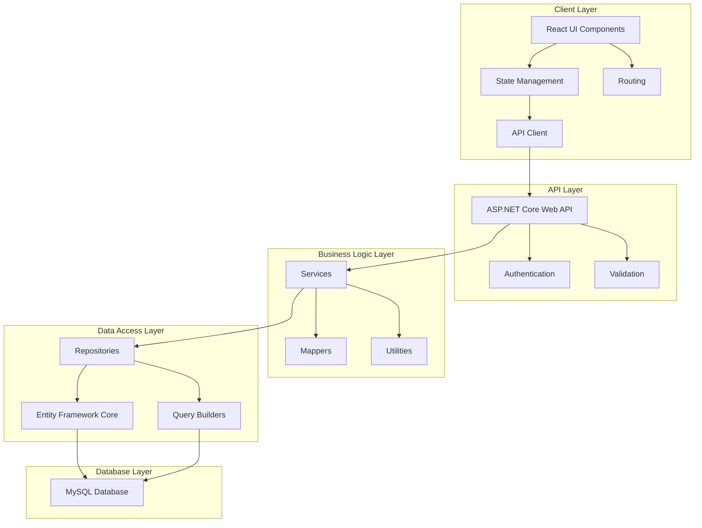
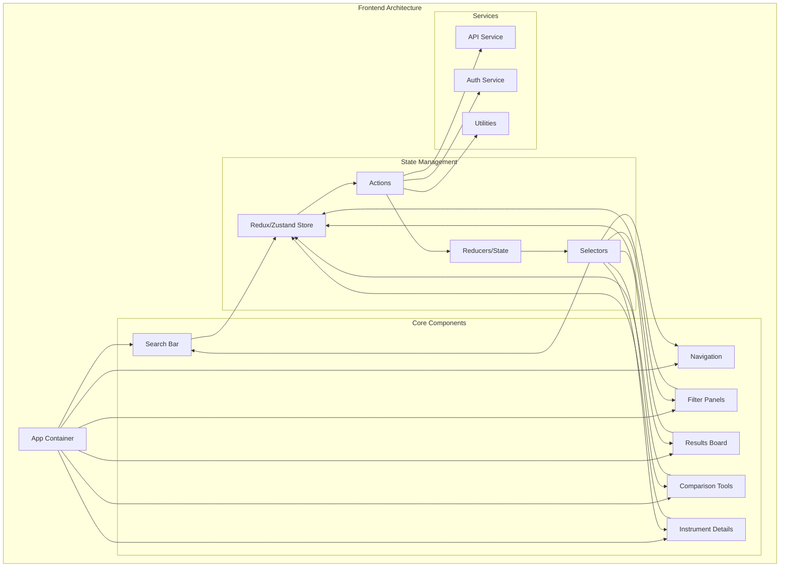
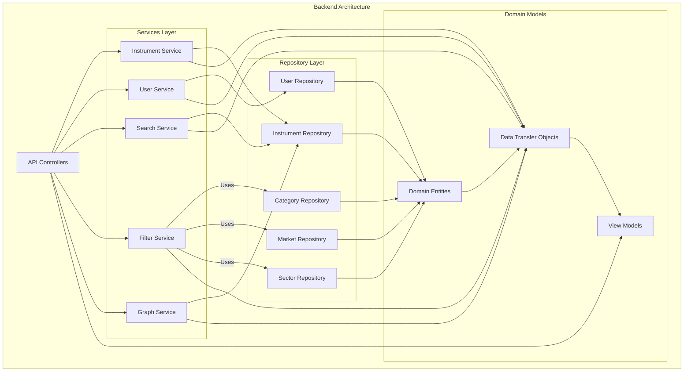
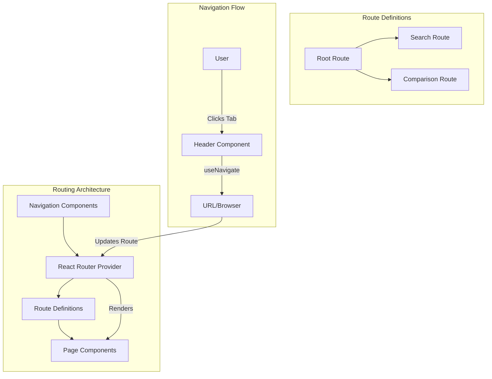
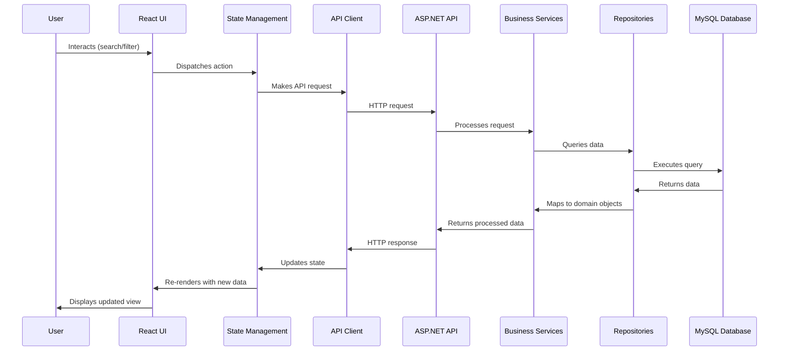

# System Patterns: Hill Metrics Financial Screener

## System Architecture Overview

Hill Metrics follows a modern, layered architecture that separates concerns and promotes maintainability, scalability, and testability. The application is built using a client-server model with clear separation between frontend and backend components.

## Key Component Relationships

### Frontend Components

### Backend Components

## Design Patterns in Use

### 1. Repository Pattern
- **Purpose**: Abstracts the data access layer and provides a collection-like interface for domain objects.
- **Implementation**: Each entity type has a corresponding repository (e.g., `InstrumentRepository`, `UserRepository`).
- **Benefits**: Centralizes data access logic, facilitates testing through mocking, and decouples business logic from data access.

### 2. Dependency Injection
- **Purpose**: Manages dependencies between components and promotes loose coupling.
- **Implementation**: ASP.NET Core's built-in DI container registers services with appropriate lifetimes.
- **Benefits**: Improves testability, facilitates component replacement, and manages object lifetimes.

### 3. MVC/MVVM Pattern
- **Purpose**: Separates concerns in the UI layer.
- **Implementation**: React components (View), State management (ViewModel/Model), API services (Model).
- **Benefits**: Improves maintainability, testability, and separation of concerns.

### 4. Command Query Responsibility Segregation (CQRS)
- **Purpose**: Separates read and write operations for more complex domains.
- **Implementation**: Separate query and command handlers for complex operations.
- **Benefits**: Optimizes read and write operations independently, improves scalability.

### 5. Adapter Pattern
- **Purpose**: Converts interfaces of external services to be compatible with the application.
- **Implementation**: API clients and data mappers.
- **Benefits**: Isolates external dependencies, simplifies integration with third-party services.

### 6. Strategy Pattern
- **Purpose**: Defines a family of algorithms and makes them interchangeable.
- **Implementation**: Different filtering strategies for various asset types.
- **Benefits**: Enables runtime selection of appropriate algorithms based on context.

### 7. Observer Pattern
- **Purpose**: Defines a subscription mechanism to notify multiple objects about events.
- **Implementation**: React's state management (Redux/Zustand) for UI updates.
- **Benefits**: Loose coupling between components, efficient updates when data changes.

### 8. Refs and Imperative Handle Pattern
- **Purpose**: Provides a way to access and interact with DOM elements or React components imperatively.
- **Implementation**: Using React's `useRef`, `forwardRef`, and `useImperativeHandle` hooks to expose component methods.
- **Benefits**: Enables bidirectional communication between components, allows parent components to call methods on child components.
- **Example**: Filter pills and filter state synchronization, where removing a filter pill updates the underlying filter state.

### 9. Drag and Drop Pattern
- **Purpose**: Enables intuitive user interaction for reordering items in a list.
- **Implementation**: Using HTML5 Drag and Drop API with React event handlers.
- **Benefits**: Provides a natural way for users to reorganize content, enhances user experience for ordering operations.
- **Example**: Column reordering in the DataTable component, allowing users to change the order of table columns.

### 10. Component State Persistence Pattern
- **Purpose**: Maintains component state across renders and user interactions.
- **Implementation**: Using React's useState hook with functional initializers to set initial state.
- **Benefits**: Preserves user preferences and configurations during a session, improves user experience by maintaining customizations.
- **Example**: Column visibility and order settings in the DataTable component, which persist even after other UI interactions.

### 11. Routing Pattern
- **Purpose**: Manages navigation between different views/pages in a single-page application.
- **Implementation**: Using React Router with declarative routes and navigation hooks.
- **Benefits**: Enables bookmarkable URLs, browser history integration, and code-splitting based on routes.
- **Example**: Navigation between Search and Comparison pages, with the Header component using the router for tab switching.

## Frontend Routing Implementation

The application uses React Router v7 for client-side routing with the following implementation:

1. **Route Configuration**:
   - Routes are defined in the App component using `createBrowserRouter`
   - Default route (`/`) redirects to the Search page
   - Dedicated routes for Search (`/search`) and Comparison (`/comparison`) pages

2. **Navigation Components**:
   - Header component handles navigation between tabs
   - Uses `useNavigate` hook for programmatic navigation
   - Uses `useLocation` hook to determine the active tab based on the current route

3. **Page Components**:
   - Each route renders a specific page component (SearchPage, ComparisonPage)
   - Pages are lazy-loaded for better performance (code splitting)
   - Common components (like Header) are shared between pages

4. **Navigation Flow**:
   - User clicks on a tab in the Header
   - Header component navigates to the corresponding route
   - Router renders the appropriate page component
   - URL is updated to reflect the current page

## Data Flow

## Key Technical Decisions

### 1. Technology Stack Selection
- **Decision**: .NET Core for backend, React for frontend, MySQL for database
- **Rationale**: 
  - .NET Core provides excellent performance, cross-platform capabilities, and robust ecosystem
  - React offers component-based architecture, virtual DOM for efficient updates, and strong community support
  - MySQL provides reliable relational database capabilities with good performance characteristics

### 2. State Management Approach
- **Decision**: Redux/Zustand for state management
- **Rationale**: 
  - Predictable state updates
  - Centralized state management
  - Developer tools for debugging
  - Middleware support for side effects

### 3. API Design
- **Decision**: RESTful API with resource-based endpoints
- **Rationale**: 
  - Familiar and widely adopted pattern
  - Stateless architecture for scalability
  - Leverages HTTP caching mechanisms
  - Clear separation of concerns

### 4. Authentication Strategy
- **Decision**: JWT (JSON Web Tokens) for authentication
- **Rationale**: 
  - Stateless authentication
  - Reduced database lookups
  - Support for claims-based authorization
  - Scalable across multiple servers

### 5. Database Schema Design
- **Decision**: Normalized schema with specific tables for different asset types
- **Rationale**: 
  - Maintains data integrity
  - Reduces redundancy
  - Supports complex queries
  - Accommodates diverse asset-specific attributes

### 6. Search Implementation
- **Decision**: MySQL's full-text search capabilities
- **Rationale**: 
  - Native database support
  - Good performance for moderate-sized datasets
  - Supports advanced text search features
  - Simplifies infrastructure requirements

### 7. Routing Implementation
- **Decision**: React Router v7 with declarative routes
- **Rationale**:
  - Modern API with hooks support
  - Declarative route definitions
  - Support for nested routes and layouts
  - Integration with browser history API

## Performance Considerations

1. **Database Indexing**
   - Strategic indexes on frequently queried columns
   - Composite indexes for common filter combinations
   - Full-text indexes for search functionality

2. **Caching Strategy**
   - Client-side caching of reference data
   - Server-side caching of frequently accessed data
   - HTTP caching headers for appropriate resources

3. **Query Optimization**
   - Efficient JOIN operations
   - Pagination for large result sets
   - Selective column retrieval
   - Query parameterization

4. **Frontend Performance**
   - Code splitting for reduced initial load time
   - Virtualized lists for large datasets
   - Memoization of expensive computations
   - Optimized re-rendering with React.memo and useMemo

## Security Patterns

1. **Authentication and Authorization**
   - JWT-based authentication
   - Role-based access control
   - Claims-based authorization for fine-grained permissions

2. **Data Protection**
   - Input validation and sanitization
   - Parameterized queries to prevent SQL injection
   - HTTPS for all communications
   - Password hashing with secure algorithms

3. **API Security**
   - Rate limiting to prevent abuse
   - CORS configuration for controlled access
   - Security headers (CSP, HSTS, etc.)
   - Request validation middleware

## Testing Strategy

1. **Unit Testing**
   - Service layer logic
   - Repository methods
   - React component rendering
   - State management logic

2. **Integration Testing**
   - API endpoint behavior
   - Database interactions
   - Authentication flows

3. **End-to-End Testing**
   - Critical user journeys
   - Cross-browser compatibility
   - Responsive design verification

4. **Performance Testing**
   - Load testing for concurrent users
   - Query performance under load
   - Client-side rendering performance
